# Audiology

An interactive scale, chord, and MIDI explorer for studying harmony and practicing
progressions — rendered as an Ableton-Push-style pad grid, a piano keyboard, and
pitch-class diagrams, with live MIDI-file playback and real-time, theory-engine-backed
analysis. Its north star is to become **a GUI for the [Tonality](#tonality-integration)
music-theory engine**.

<p align="center">
  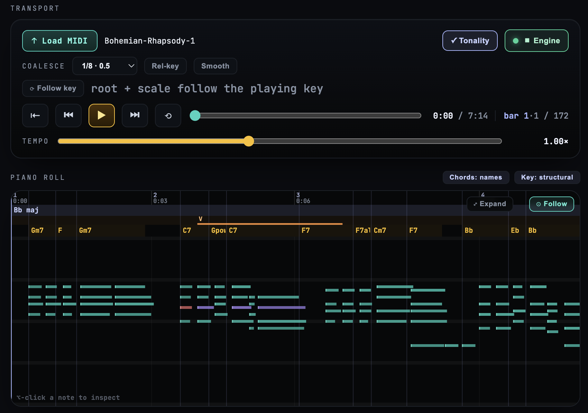
</p>
<p align="center"><sub>A loaded MIDI file analysed by the Tonality engine — the structural key strip
(B♭ maj), a tonicization pivot lane, and the per-segment chord strip over the piano roll.</sub></p>

## Features

- **Scale & chord explorer** — 27 scales, 20 chord qualities, inversions and voicings,
  laid out on an 8×8 pad grid (4ths / 3rds / sequential, in-key or chromatic), a piano
  keyboard, and **Bracelet** (pitch-class clock) + **endless Tonnetz** diagrams. Surfaces
  are optional modules toggled in a **Views** bar.
- **Build / Analyze / Live modes** — build chords and audition them (with adapt-to-scale),
  tap notes to identify chords, or watch a playing MIDI file get analyzed in real time.
- **MIDI playback** — load a `.mid` file and watch it play on a piano-roll timeline with a
  moving playhead, a tempo-accurate **bar/time ruler**, follow-scroll, loop, tempo slider,
  and scrub/step controls.
- **Score view** — the loaded MIDI as a traditional grand staff (clefs, accidentals honoring the
  sharp/flat setting, ledger lines, stems) that scrubs in lockstep with the piano roll: same time
  axis, same playhead, click-to-seek, sounding notes glowing. Proportional notation in v1 (x is
  time; rhythm glyphs are a later refinement).

  <p align="center">
    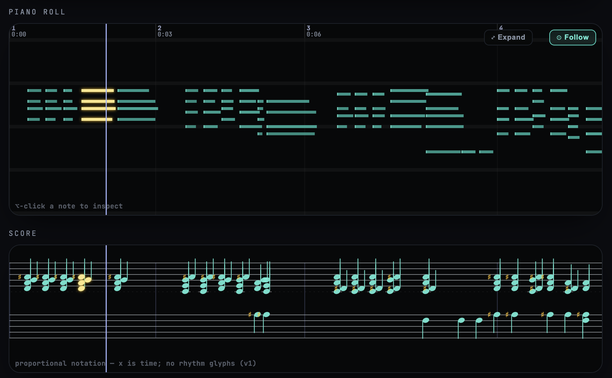
  </p>
  <sub>The loaded file on a grand staff above the piano roll — both share the time axis and playhead,
  so scrubbing one scrubs the other; sounding notes glow.</sub>

- **Per-channel instruments** — each MIDI channel plays through its own timbre from a bank of
  oscillator presets (piano, organ, pluck, bass, strings, brass, flute, synth lead/pad…) plus a
  synthesized **drum kit** for percussion channels. Instruments are auto-assigned from the file's
  General MIDI programs on load and overridable per channel in the **Instruments** view (with a
  "treat as drums" toggle for files that aren't GM-normalized). All synthesis is built-in — no
  samples, no network.

  <p>
    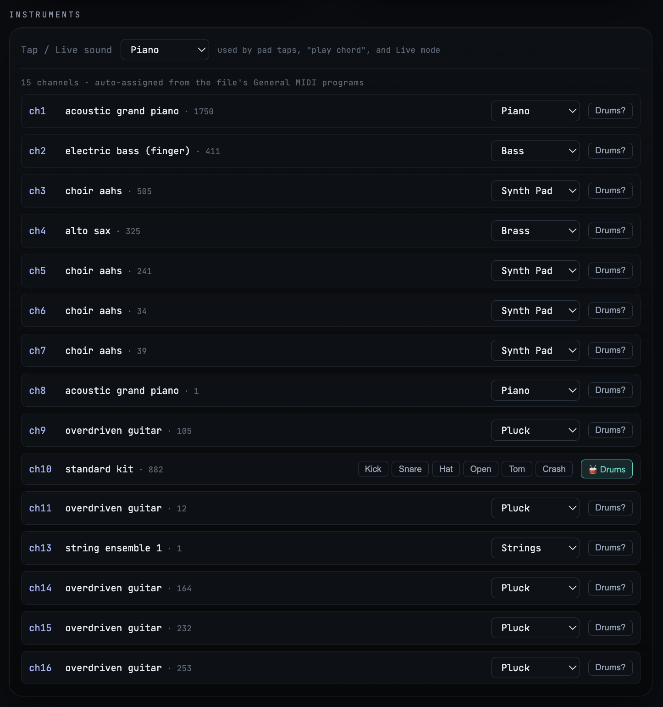
  </p>
  <sub>Per-channel instrument assignment, auto-set from the file's General MIDI programs — each
  channel gets a preset picker; percussion channels route to the drum kit.</sub>

- **Follow-the-key** — a transport toggle that auto-switches the explorer's root + scale to the
  **local key under the playhead** as the file plays (the windowed key track, so it tracks
  modulations the structural reduction absorbs), with the Circle-of-5ths view tracing the journey
  and the MIDI-file-key card headlining the current local key.
- **Theory-engine analysis** — with the Tonality engine running, a loaded file is analyzed
  for its key, **structural key-areas**, tonicizations (an orange **pivot lane** with Roman
  numerals), and per-segment chords. The chord strip toggles between **names / Roman
  numerals / both** (with applied dominants like `V/V` and single-note scale degrees), and
  notes are coloured in-key / out-of-key / drums.
- **Live analyzer** — the analyzer names the chord currently sounding (engine-backed when
  connected, local fallback otherwise), with functional role and alternatives.
- **Chord Anatomy** — a view that demystifies the current chord across three panels: **Colour**
  (root-aware circle-of-fifths and root-blind interval-content colour wheels, each showing the
  resultant-vector construction), **Intervals** (interval-vector histogram; a stacked **interval-
  bracket diagram** showing every pair above the root nesting into wider intervals; set-class /
  prime-form / bitmask), and a **Harmony map** (consonance × major/minor chirality, plotting the
  chord over the trichord landscape). The graphs persist as scaffolding so the section never blinks
  out during playback. When the Tonality engine is connected, the set-class facts come from the
  engine (an "engine / local" badge shows the source); otherwise they're computed locally.

  <p>
    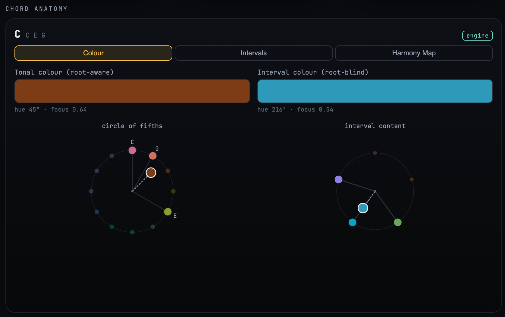
    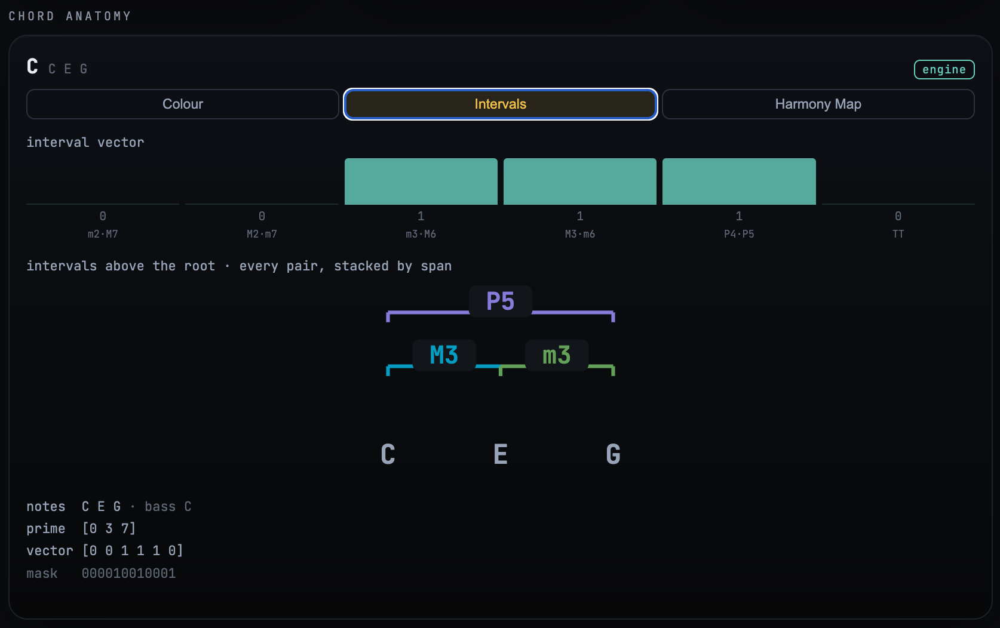
    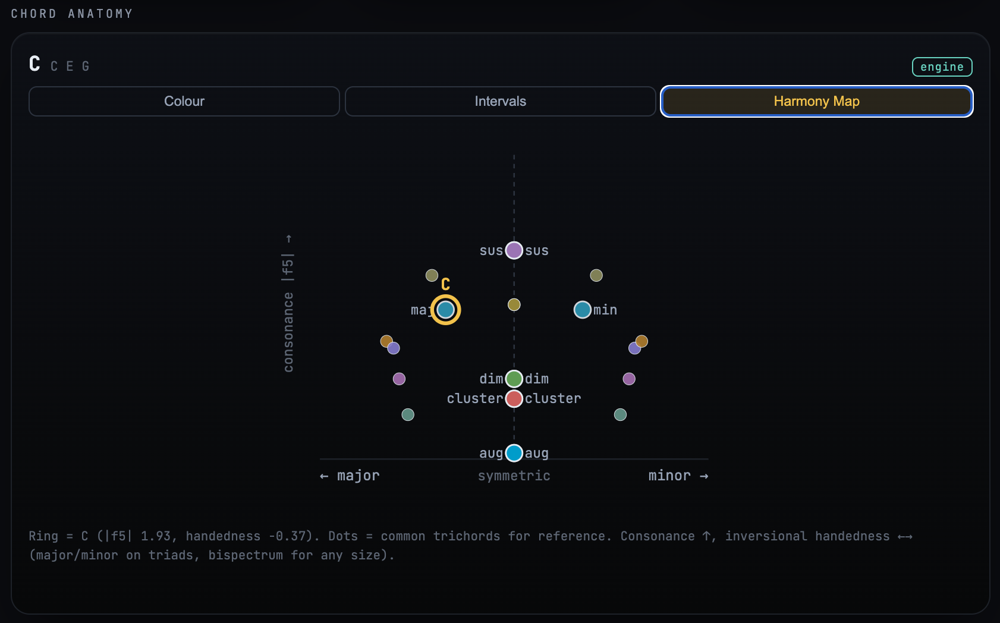
  </p>
  <sub>Chord Anatomy's three panels for a C major triad — <b>Colour</b> (the two resultant-vector
  wheels), <b>Intervals</b> (interval vector + bracket diagram + set-class), and the <b>Harmony map</b>
  (consonance × major/minor chirality). The "engine" badge shows the set-class facts are coming from
  Tonality.</sub>

- **Analysis console** — the verbose, copyable text/numbers view of everything the analysis
  knows, at four scopes: the **current chord** (set-class identity, full DFT, chirality family,
  the engine's complete naming with every alternative and score), the **playhead instant**
  (sounding notes + the key/tonicization/chord context under the cursor), **every key region**
  (including the low-confidence ones the strips absorb, with honest margins), and the **whole
  file** (every ranked key candidate, structural home, itemized MIDI-read losses). Engine-backed
  when connected, local fallbacks otherwise; a JSON toggle shows the raw objects.

  <p>
    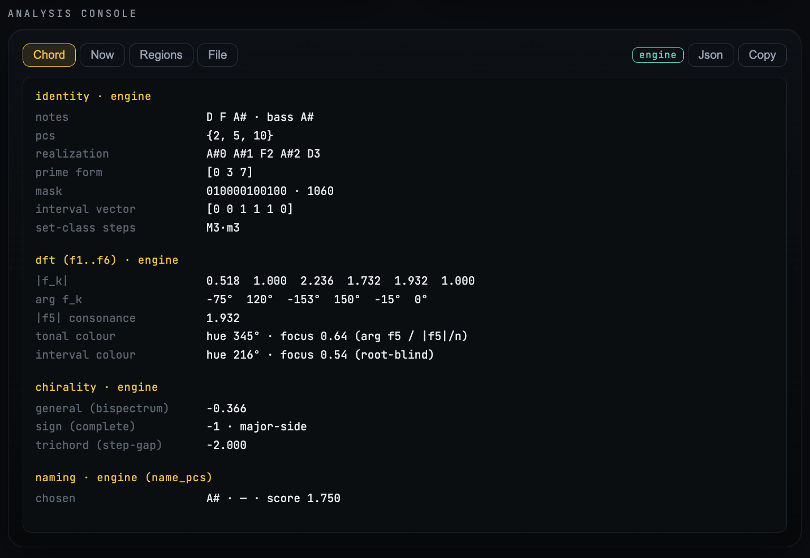
  </p>
  <sub>Everything the analysis knows, as copyable text/numbers, at four scopes (current chord ·
  playhead instant · every region · whole file), with a raw-JSON toggle.</sub>

- **Pc-set lab** — a chromatic-rail editor for building an arbitrary pitch-class set (or seeding
  one from the current scale / selection) and reading its full set-theory profile: normal order,
  prime form, interval vector, mask, transpositional + inversional symmetry, complement, DFT
  colour, a **bracelet** (pitch-class clock, also an editor), the catalog scales/chords it matches
  (Push-3-available scales flagged, tap to apply to the explorer), the scales it sits inside, and
  its modes. Identity is engine-backed when connected.

  <p>
    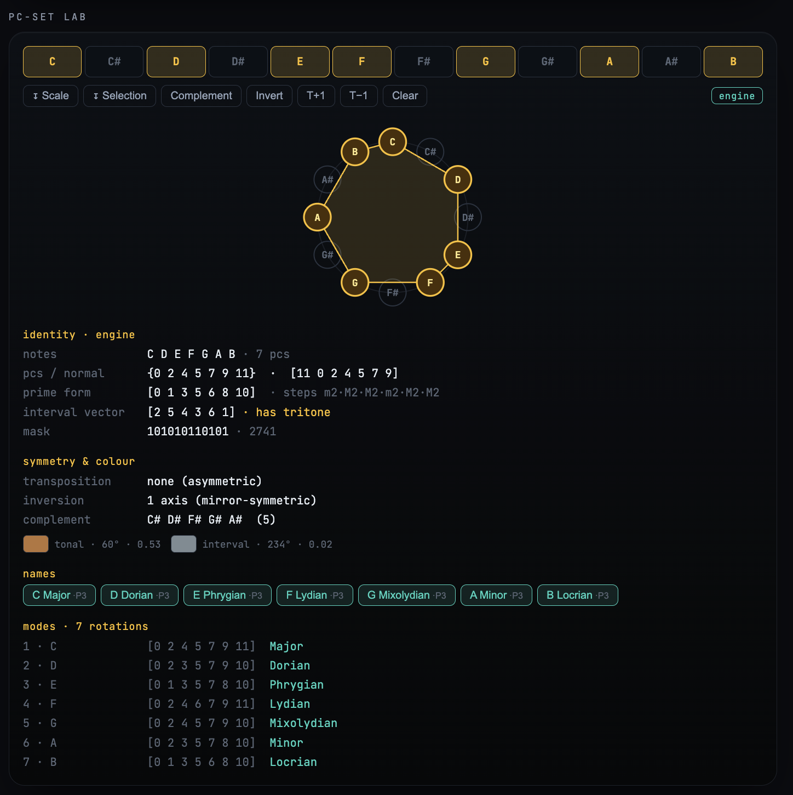
  </p>
  <sub>The pc-set lab on the C-major set — the bracelet clock above the set-class read-out (prime
  form, interval vector, symmetry, colour) and the named modes/scales it matches.</sub>

- **Callable by other apps** — Audiology's analysis is exposed for other projects to consume, over
  an **MCP server** (`npm run mcp`) and a loopback **HTTP API** (`npm run api`) — one versioned
  tool registry, two transports — with a published [integration protocol](INTEGRATION.md). See
  [`docs/MCP.md`](docs/MCP.md).

## A look at the surfaces

The explorer surfaces (toggled in the **Views** bar):

<p>
  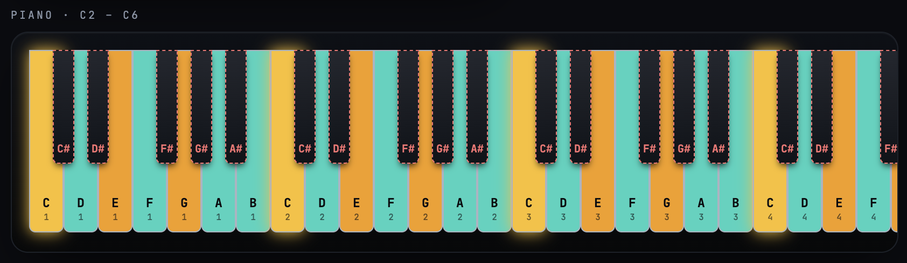
  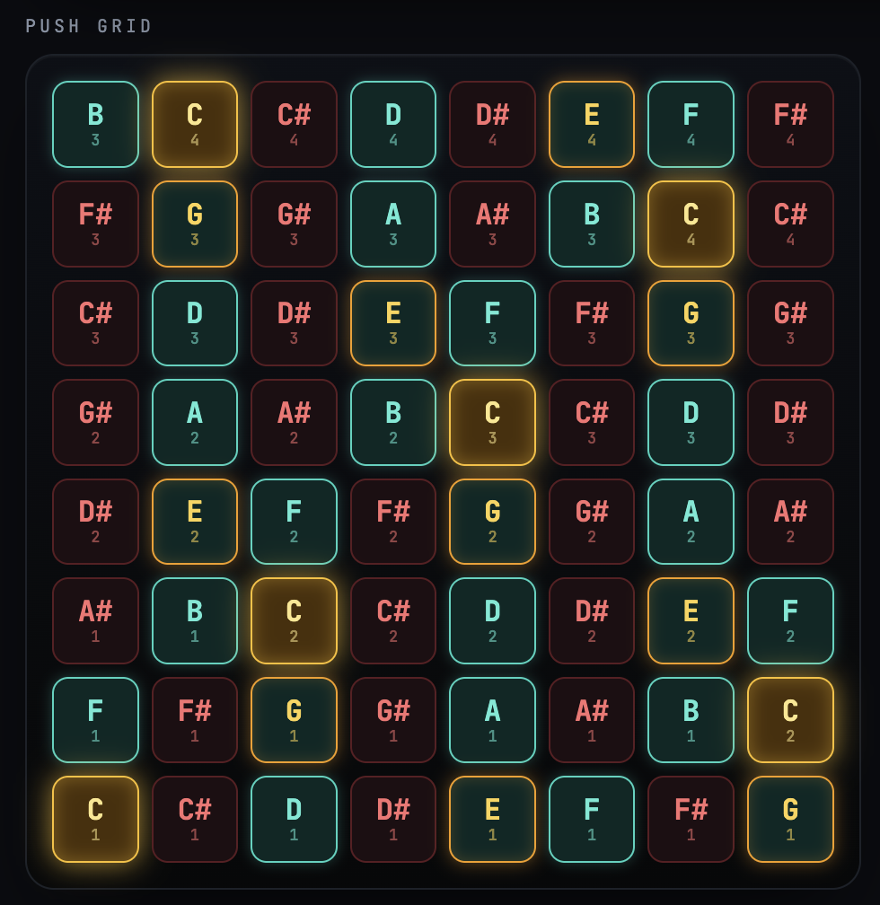
</p>
<p>
  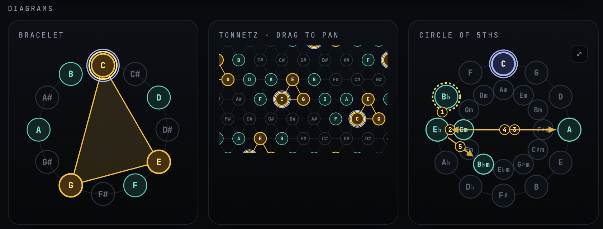
</p>
<sub>The C2–C6 piano and the 8×8 Push grid (teal = in scale, amber = chord tone, red = out of scale),
and the <b>Bracelet</b> / endless <b>Tonnetz</b> / <b>Circle of Fifths</b> pitch-class diagrams.
The <a href="docs/fullpage.png">whole app in one view</a>.</sub>

## Getting started

This is a self-contained frontend — **Node 18+ is the only requirement.** No Python, no
backend, no API keys.

```bash
git clone <this-repo> && cd Audiology
npm install
npm run dev        # Vite dev server on http://localhost:5173
```

That's it — the scale/chord explorer, the **Chord Anatomy** view, MIDI-file playback, and a
local chord analyzer all work with **nothing else installed**.

Other scripts:

```bash
npm run build      # production build
npm run preview    # preview the production build
npm run typecheck  # tsc --noEmit
```

### Optional: the Tonality engine (deeper analysis)

A few features — whole-file **key / structural-area / chord analysis** of loaded MIDI, and
engine-backed live chord naming — are powered by the separate
[Tonality](https://github.com/Lifted-Truck/Tonality) music-theory engine. **This is entirely
optional; everything above runs without it.** It is *not* an npm dependency — the dev server
launches it on demand when you click **"⏻ Start engine"** in the transport.

To enable it: clone Tonality, set up its Python env (see its README), then either place it
**next to this repo** (`../Tonality` — the zero-config default) or tell the dev server where it
is. The simplest way is a local env file:

```bash
cp .env.example .env.local      # then set TONALITY_DIR=/path/to/Tonality
npm run dev
```

`.env.local` is gitignored; the dev server reads `TONALITY_DIR` (plus optional `TONALITY_PYTHON`
/ `TONALITY_PORT`) from it — or from a shell env var (`TONALITY_DIR=… npm run dev`). The engine
talks to the app over a local HTTP bridge — see [Tonality integration](#tonality-integration).

## Architecture

A framework-free core is kept strictly separate from the React UI:

```
src/
  lib/theory/    Pure music theory — scales, chord qualities, pitch, voicings, chord
                 analysis (analyzeSelection), scale detection, Roman-numeral analysis
                 (roman.ts), and chord-anatomy maths (chord-anatomy.ts: interval vector,
                 DFT, the two colour resultants, chirality, interval brackets). No React.
  lib/midi/      MIDI parsing (@tonejs/midi → Song; notes carry beats/duration/drum,
                 Song carries beatsToSeconds / timeToBarBeat / barStarts) + time queries
                 + keyboard/Web-MIDI input. No React.
  lib/tonality/  The Tonality integration boundary — the only module that knows the
                 engine's wire format (probe / nameChord / setClassInfo / analyzeMidi /
                 structuralKeys); everything downstream consumes normalized data.
  lib/state/     The derivation layer between App's raw state and what the views render:
                 analysis-strip selectors (key bands, chord regions, tonicizations,
                 follow-key signals), grid/piano cell builders, pad styling. Pure and
                 React-free — App's memos are one-line wrappers around these selectors.
  geometry/      piano.ts — the single source of truth for the pitch axis, shared by the
                 Piano keyboard and the PianoRoll so they stay aligned.
  audio/         synth.ts (one shared synth) + transport.ts (anchor-pair clock + lookahead).
  hooks/         usePlayback, useAudioContext, useLiveInput, useBridge, useEngineProcess,
                 useEngineFacts (the generic engine-consume seam: debounced fetch when
                 connected, local fallback when not) + useChordFacts built on it.
  components/    Grid, Piano, PianoRoll, TransportBar, Bracelet, Tonnetz, CircleOfFifths,
                 ChordAnatomy, ControlPanels.
  App.tsx        Owns state, wires it into lib/state selectors, composes the views.
```

### Key invariants

- **The pure core imports no React.** `lib/theory/*`, `lib/midi/*`, and `lib/state/*` stay
  testable and framework-free; `lib/tonality/*` is the sole engine-wire boundary.
- **One synth, one clock.** All audio runs through a single `AudioContext` and the `playMidi`
  synth; the transport schedules on the Web Audio clock.
- **Song-time vs audio-time.** Playback maps song seconds to audio-context seconds via an
  *anchor pair* and a tempo multiplier — never by accumulating wall-clock time.
- **`geometry/piano.ts` owns the pitch axis** so the keyboard and piano-roll always line up.
  MIDI follows the Ableton convention (C3 = 60); the visible range is 36..84.

> **Working in this repo with Claude Code?** [CLAUDE.md](CLAUDE.md) is the agent-facing
> source of truth — invariants, conventions, gotchas, current status, the Tonality bridge
> mechanics, and the open engineering threads.

## Tonality integration

Audiology consumes [Tonality](https://github.com/Lifted-Truck/Tonality), a local-first
music-theory engine, over its official HTTP bridge (`python -m mts.mcp.bridge`, loopback
`:8012`). The dev server can spawn/stop the bridge on demand. `src/lib/tonality/` is the only
module that speaks the engine's wire format; the UI consumes normalized data.

The integration is **consume-when-connected**: where the engine is up, Audiology prefers its
determinations (e.g. Chord Anatomy's set-class identity, DFT, and chirality from `set_class_info`)
and falls back to the local pure-theory core when it isn't — so the app stays fully usable offline.
The north-star (see Roadmap) is to make the engine the single source of truth and retire the
duplicated local math once the engine can be packaged with the app.

The two projects coordinate through a brief/response channel in the Tonality repo
(`integrations/audiology/`), backed by a corpus **validation harness** (`validation/` in the
Tonality repo) that scores engine key/region output against human-annotated datasets
(When-in-Rome, Schubert Winterreise). See CLAUDE.md for the bridge mechanics and the
bytes→path file-analysis adapter.

## Roadmap

Near-term feature work and known bugs are tracked in [CLAUDE.md](CLAUDE.md) ("Open
engineering threads"). The longer-horizon direction:

- **Tonality at the core (north star).** Today the app duplicates a lot of theory locally
  (interval vector, DFT, set-class, chirality, chord naming, scale detection) so it can run
  standalone, with the engine as an optional sidecar. The end state is the inverse: **Tonality
  is the single source of truth**, and that duplicated client-side math is *removed* — one
  implementation, no drift. The blocker is runtime: Tonality is Python, so "baked in" means the
  engine **travels with the app** rather than being a separately-cloned sidecar — via an
  in-browser Python (Pyodide/WASM), a bundled engine binary, a desktop shell (Tauri/Electron)
  that ships Python, or porting the hot core to WASM. The migration path is already open: (1)
  **consume-when-connected** — prefer engine outputs wherever the bridge is up, keep local as a
  fallback (the `set_class_info` outputs Tonality just shipped — `dft_phases`, both chiralities,
  `prime_form` — make the Chord Anatomy surfaces the first candidate); (2) pick a packaging
  strategy so the engine is always present; (3) delete the now-redundant local math. Until step 2
  lands, the standalone-friendly local core stays — this is the destination, not a near-term flip.
- **Native desktop app (off the browser).** Eventually Audiology should ship as its own
  application rather than a browser tab — for lower-latency audio/MIDI, real file access, OS MIDI
  I/O, and an installable artifact. A desktop shell (**Tauri** or Electron) is also the natural
  vehicle for *Tonality at the core* above: it can bundle the Python engine (or a packaged binary)
  so "baked in" and "native" are one move. It's a big port, so the discipline to protect now is
  **modularity** — keep the pure core React-free and platform-agnostic, keep all browser-specific
  surfaces (Web Audio, Web MIDI, File API, the Vite dev-server bridge launcher) behind narrow,
  swappable seams, so the shell can replace them one at a time. Every new feature should respect
  that boundary so the port stays painless rather than a rewrite. *(Interim: a convenience desktop
  launcher — [`docs/DESKTOP.md`](docs/DESKTOP.md), `scripts/launch-audiology.command` — starts the
  dev server + opens the app from a double-click icon; the real native app is the Tauri work above.)*
- **A modular surface for music education.** The larger aim: Audiology's interactive surfaces
  (grid, piano, roll, bracelet/Tonnetz/circle, Chord Anatomy) plus Tonality's determinations become
  reusable **building blocks** that a variety of interactive teaching programs can drive — Audiology
  supplies the interaction + rendering, Tonality supplies the theory, the program supplies the
  pedagogy. Programs envisioned (some in progress with collaborators):
  - **Ear training** — a research-backed **pitch-identification** trainer (**CHROMA**, the first
    module, scoped in [`docs/proposals/chroma-pitch-training.md`](docs/proposals/chroma-pitch-training.md)
    with a provisional [module-host contract](docs/proposals/module-contract-sketch.md)); **interval**
    recognition **both in and out of a tonic context**; **chord** quality / inversion / function; and
    other listening drills.
  - **Visual identification flashcards** — recognise a chord/scale/interval/key **across the different
    representations** (pad grid, keyboard, staff-less pitch clock, Tonnetz, circle of fifths, colour
    wheels), so a learner connects the same object across notations.
  - **Structured theory courses** — sequenced lessons from beginner to advanced, using the explorer
    and analysis as the live worked-example surface.

  What makes this tractable is keeping the pieces modular and exchangeable: the **Audiology MCP** and
  **Greater modularity** items below are the enabling seams (drive the surfaces, publish/consume
  progress), and **spaced-repetition sequencing** is driven by **progress reports imported from a
  separate learning app** so it reflects real mastery, not in-app state alone. *(Being workshopped.)*
  Two shared build items the first module surfaces (both outlive CHROMA): a **multi-timbre audio
  subsystem** — **now shipped** as the per-channel instrument bank (`audio/instruments.ts`:
  oscillator presets + a synth drum kit); a training module still needs *masking* and
  held-out-timbre transfer on top of it — and a **telemetry sink** for cohort studies (emission is
  easy; collection + consent/identity is real plumbing a standalone frontend lacks — a natural fit
  for the Audiology MCP below).
- **Audiology as the face — the callable surface** *(v1 shipped; [`INTEGRATION.md`](INTEGRATION.md), [`docs/MCP.md`](docs/MCP.md))*.
  Audiology's capabilities are exposed for other projects to consume — analysis over an **MCP
  server** (`npm run mcp`) *and* a loopback **HTTP API** (`npm run api`), one versioned tool
  registry, two transports; and the **integration protocol is published** (`INTEGRATION.md` + the
  `integrations/` intake channel with the ball-state brief protocol), so a consumer repo — the
  music-education app is consumer #1 — can start now against the contract and file briefs for gaps.
  *Remaining:* **v2 representation-as-SVG** (`render_*`: bracelet/Tonnetz/circle/score/anatomy —
  needs the headless-renderer extraction, which also serves the surface-library direction) and
  **v3 audio-spec + session** tools.
- **Greater modularity** — formalize the existing discipline (pure core, single engine-wire
  boundary, optional Views) into a real mode/surface plugin seam and a stable internal data
  model the MCP can publish. (The MCP proposal above is this seam's forcing function.)
- **Ian Ring parity** *(spec in [`docs/proposals/ian-ring-parity.md`](docs/proposals/ian-ring-parity.md))* —
  show, for any scale/pc-set, every representation and datum Ian Ring's site presents: a local
  property pack (hemitonia, imperfections, deep-scale, Myhill, maximal-evenness…), names + Forte
  number from the engine, distribution spectra, a set-class lattice, and staff notation. A backlog
  to burn down, not a sprint.
- ~~**Follow-the-key mode**~~ — **shipped**: a transport toggle that auto-switches the explorer's
  root+scale to the current playback segment's **local** (windowed) key as the playhead moves, with
  the Circle-of-5ths view showing the journey and the MIDI-file-key card headlining the local key.
- ~~**"Deeper analysis" mode**~~ — **shipped** as the **Analysis console** view: an opt-in
  surface with everything the engine returns as verbose text/numbers, in four scopes (current
  chord · playhead instant · every region with honest margins · whole file), copyable, with a
  raw-JSON toggle.
- ~~**Custom-scale analysis**~~ — **shipped** as the **Pc-set lab** view: a chromatic-rail
  scale/pc-set editor that surfaces interval vector, prime form / set-class, transpositional &
  inversional symmetry, complement, DFT "harmonic colour", modes, and the named scales/chords the
  set is (or sits inside) — Push-3-available scales flagged and tap-to-apply to the explorer.
### Chord Anatomy & harmonic geometry *(shipped — this records the foundations + open threads)*

The **Chord Anatomy** view (see Features) demystifies *why* chords sound related or different,
organized around one idea: a chord has an inversion-invariant **identity** and a voicing-sensitive
**realization**. Maths is React-free in `src/lib/theory/chord-anatomy.ts`. The design, the
findings worth preserving, and the engine integration:

- **Clinical surfaces.** Interval vector (the inversion-invariant fingerprint), stacked intervals
  bottom-up (which rotate under inversion), set-class prime form, and the 12-bit pc bitmask.
- **Somatic colour — two complementary wheels.** Both build the colour as a **resultant vector**
  (a circular mean of points on a wheel), the principled form of "add the hues":
  - *Root-aware* (circle-of-fifths): each pitch class is a hue on the fifths circle; the resultant's
    angle = hue, length = "focus"/saturation. Transposition rotates it; symmetric chords cancel to grey.
  - *Root-blind* (interval-content): rim = the five inversion-paired interval classes weighted by the
    interval vector, the self-inverse tritone at the centre; **transposition-invariant**, so inversional
    pairs collapse (maj = min, dom7 = m7♭5) and symmetric chords that grey out on the pitch wheel turn
    vivid (aug = pure M3). The two wheels are complementary coordinates: *what intervals* vs *how rooted*.
  - *Encoding.* Register → **perceptually-uniform** OKLCH lightness (not HSL L, which clumps), plus a
    sub-linear focus→chroma stretch to decompress the crowded grey centre.
  - *Known domain constraint* (from enumerating all 4083 pc-sets): the interval-colour reaches only a
    sparse finite cloud of 185 points, heavily massed near grey (109 < 0.15 focus); only the five pure
    dyads + the augmented triad reach full saturation (richness vs saturation are in tension). So colour
    discriminates extremes well, the muddy centre poorly — never rely on it alone.
- **Harmony map — discord vs concord geometry** (Tymoczko trichord geometry, DFT/Quinn-Amiot-Yust).
  Vertical = **consonance** (perfect-fifth content `|f5|`); horizontal = **chirality** (inversional
  handedness): major and minor fall on opposite sides of a symmetric spine, clusters/aug/dim sit on it.
  Key insight it makes visible: **consonance and major/minor are orthogonal axes, not one scale.**
  - *Trichords:* the exact step-gap `(a−b)(b−c)(c−a)`. *Any cardinality:* the bispectrum slice
    `Im(f1·f2·conj(f3))` — transposition-invariant, inversion-odd, separates dom7 ↔ m7♭5. A single
    slice false-zeros on 28 exotic 5–7-note set classes; the **complete signed invariant (full
    bispectrum)** is an open theory problem owned by Tonality.

**Tonality integration** (`integrations/audiology/brief-15.md`): the maths is currently client-side;
the engine should *expose* and Audiology should *consume* — interval vector / `set_class_info` /
**DFT magnitude + phase** (phase drives both hue and chirality; the standing ask is to surface phase
over the bridge). The colour *encoding* stays Audiology's (division of labor). Two engine-side research
items: the complete general chirality, and a renderer-agnostic "interval/colour-content" descriptor for
the Representation layer (cf. the bracelet/Tonnetz descriptors in `brief-2`).

**Future view work:** a reachable-domain "**atlas**" (the 185-point cloud / harmony-map landscape as a
browsable reference), and **interactive note-picking** on the wheels and map (build a chord by clicking
and watch the resultant vector and harmony-map position move) — the point where these stop being
illustrations and become a teaching surface.

- **MIDI chord-colour timeline** — a piano-roll toggle that tints the chords of a loaded/playing
  file by their somatic colour (the Chord Anatomy colour) as the song progresses, **excluding the
  drum channel**, so harmonic motion is visible at a glance. Clean when the Tonality engine is
  connected (its per-segment chord analysis supplies the segments to colour); a fully standalone
  version needs a local chord-segmentation pass over the non-drum notes (group simultaneous/
  overlapping onsets into chord spans). Reuse the existing key-region strip mechanics for the lane.

## License

**[PolyForm Noncommercial License 1.0.0](LICENSE.md)** — © 2026 Julian Smith (Lifted-Truck).
Source-available for **noncommercial** use (personal, research, education, and other
noncommercial purposes are permitted; charitable, educational, public-research, and government
organizations count as noncommercial regardless of funding). Commercial use requires a separate
licence — contact the author. This applies to Audiology as a whole and to consuming it via the
[integration protocol](INTEGRATION.md) / the MCP + HTTP tools.
